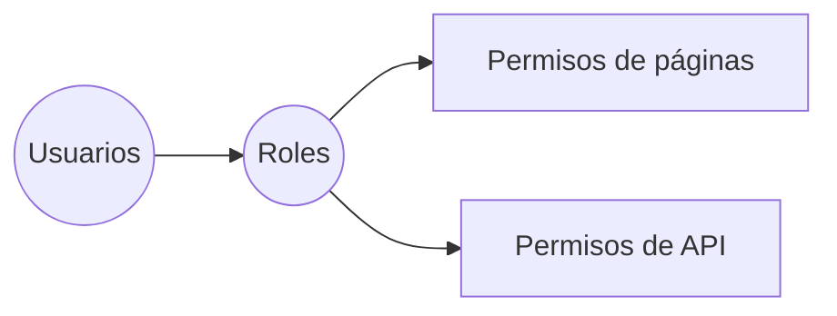

# Usuarios, Roles y Permisos

Las tablas principales para seguridad son:

- `roles`: define cada rol disponible en la plataforma.
- `users`: almacena credenciales y referencia al rol asignado.
- `page_permissions`: controla a qué páginas del frontend puede acceder cada rol.
- `api_permissions`: restringe las rutas y métodos de la API por rol.

Con esta estructura el backend valida cada petición verificando el rol del usuario autenticado y consultando sus permisos. Al definir permisos por página y por endpoint se logra un control fino que evita accesos no autorizados en todos los niveles de la aplicación.

En el diagrama puede verse de forma simple cómo los roles conectan a los usuarios con los permisos de cada página o API.
