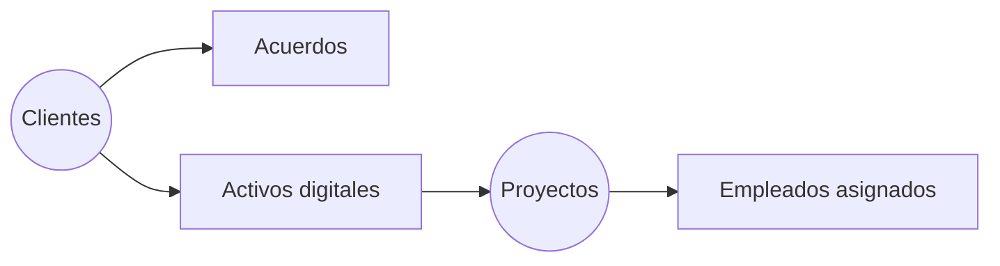

# Clientes y Proyectos

Este dominio gestiona la relación con los clientes y los activos digitales que se prueban.

- `clients` agrupa la información básica de cada cliente.
- `business_agreements` y `digital_assets` documentan los acuerdos y productos contratados.
- `user_interfaces`, `element_types` y `elements` describen la estructura de las interfaces de usuario.
- `projects` y `project_employees` permiten asignar usuarios a proyectos con distintas dedicaciones.
- `actors` y `habilities` registran los perfiles involucrados dentro del cliente.

Cada proyecto se vincula a un cliente y puede tener múltiples analistas asignados, garantizando trazabilidad entre los acuerdos comerciales y los flujos de pruebas ejecutados.

Este esquema simplificado ilustra cómo la información de cada cliente se enlaza con sus acuerdos, activos y proyectos.
