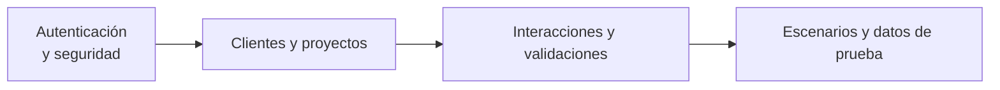

# Información General de la Base de Datos

Este proyecto usa SQLAlchemy y PostgreSQL. Todas las entidades se definen en `backend/app/models.py` y se inicializan automáticamente al levantar la aplicación. Las tablas se agrupan en cuatro grandes dominios:

1. **Autenticación y seguridad**: gestiona usuarios, roles y permisos.
2. **Clientes y proyectos**: organiza clientes, acuerdos y activos digitales.
3. **Interacciones y validaciones**: registra flujos de trabajo y sus aprobaciones.
4. **Escenarios y datos de prueba**: describe casos de prueba y datos asociados.

En total existen más de treinta tablas relacionadas entre sí mediante claves foráneas. El esquema facilita la trazabilidad completa desde las funcionalidades hasta los datos de prueba ejecutados.

El diagrama anterior resume cómo cada dominio se relaciona de forma secuencial. Así resulta más fácil comprender la estructura global sin necesidad de profundizar en detalles técnicos.
