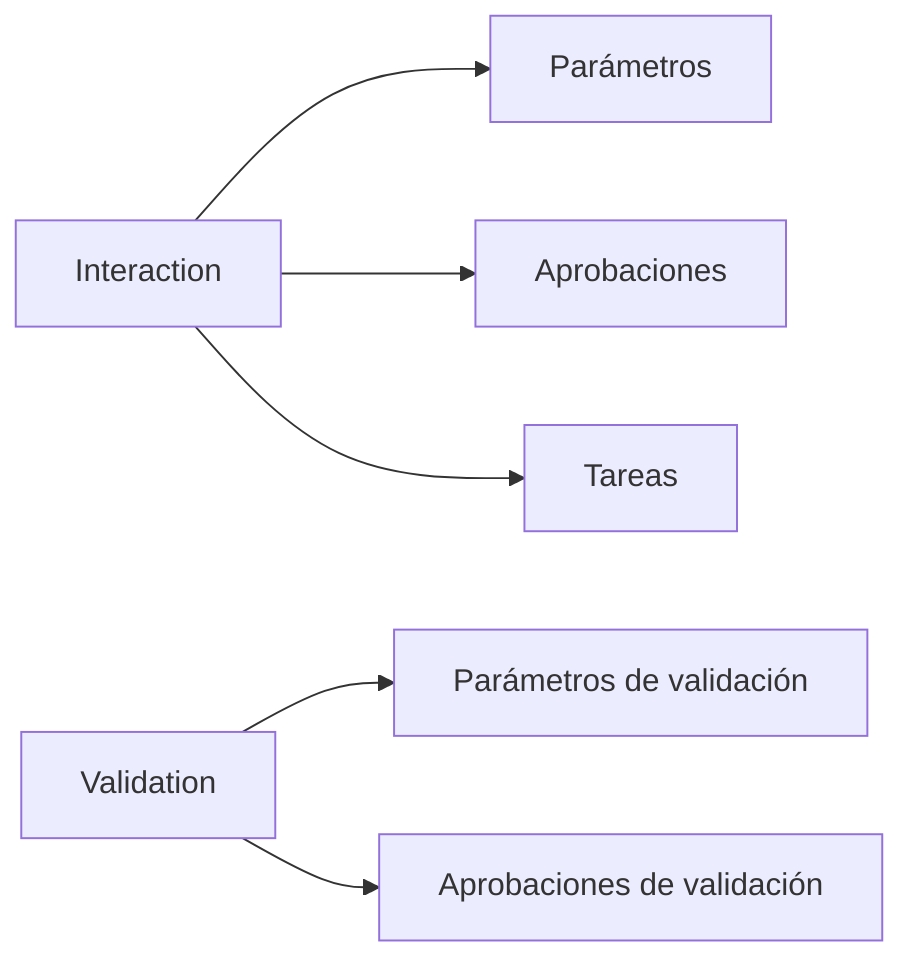

# Interacciones y Validaciones

Estas tablas modelan los pasos de prueba, sus parámetros y el flujo de aprobaciones.

- `interactions` y `interaction_parameters` definen acciones automatizadas con sus argumentos.
- `interaction_approval_states` y `interaction_approvals` permiten registrar revisiones por pares.
- `validations`, `validation_parameters` y `validation_approvals` almacenan las comprobaciones posteriores.
- `tasks` y `task_have_interactions` conectan interacciones con tareas de alto nivel.

El registro de aprobaciones y revisiones facilita el control de calidad antes de ejecutar cualquier acción en los entornos de prueba.

La gráfica muestra el ciclo básico de una interacción y sus validaciones asociadas.
