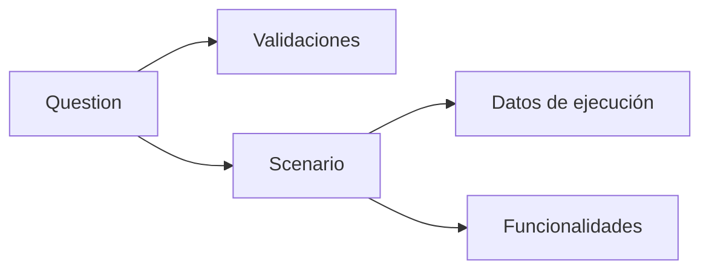

# Escenarios y Datos de Prueba

Este grupo describe los casos de prueba, las preguntas que los componen y los datos necesarios para ejecutarlos.

- `questions` y `question_has_validations` agrupan validaciones por pregunta.
- `scenarios` relaciona las preguntas con `scenario_info` y `feature_steps` para representar casos BDD.
- `scenario_data` almacena instancias de ejecución vinculadas a `raw_data` y `field_types`.
- `features`, `scenario_has_features` y `feature_steps` permiten organizar las funcionalidades en scripts reutilizables.

Con estas tablas se consigue una completa trazabilidad desde cada requisito hasta los datos generados para las pruebas automatizadas.

Este diagrama resume de forma visual cómo un escenario agrupa preguntas y genera datos de prueba asociados.
