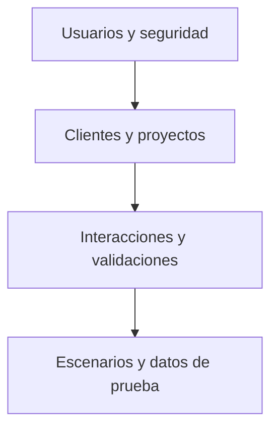
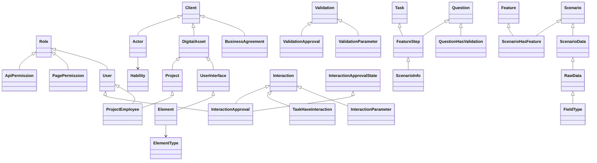

# Diagrama General de la Base de Datos

A continuación se muestra primero un esquema simplificado para facilitar la comprensión de los distintos dominios:

Para quienes requieran más detalle también se incluye un diagrama UML con todas las tablas relevantes:

Este diagrama resume las relaciones principales entre las entidades. Las flechas indican dependencias mediante claves foráneas. De esta forma puede verse cómo los usuarios se vinculan a roles y permisos, los clientes a sus proyectos y activos digitales, y los escenarios a sus datos de prueba.
